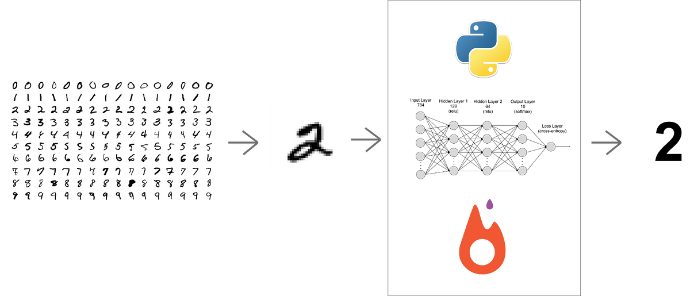

<!-- PROJECT LOGO -->
 

  

  <h3 align="center">Handwritten-Character-Recognition</h3>

  

    Handwritten Character to Editable Document Converter using Deep Learning and Streamlit
     
  

<!-- ABOUT THE PROJECT -->
## ABOUT THE PROJECT

In today's digital age, the ability to convert handwritten documents or images into editable and machine-readable formats is invaluable. This project aims to create a user-friendly web application that leverages the power of deep learning and Streamlit to seamlessly transform handwritten text from scanned documents or images into editable text documents. The application will provide an intuitive interface for users to upload images containing handwritten text, process them using deep learning models, and then download the converted text in a format like Microsoft Word or PDF.

### BUILT WITH
Here are the main modules and tool I used for the project
* [Tensorflow](https://github.com/tensorflow)
* [Keras](https://github.com/keras-team/keras)
* [Sklearn](https://github.com/topics/sklearn)
* [Google Colab](https://github.com/googlecolab)
* [Streamlit](https://github.com/streamlit)
* [OpenCV](https://github.com/opencv)

<!-- ROADMAP -->
## ROADMAP

1. Project Setup: Set up the development environment.
2. Data Preparation: Collect and preprocess the dataset.
3. Model Development: Choose, train, and validate the deep learning model.
4. Streamlit Application: Create a Streamlit app for user interaction.
5. Deployment: Deploy the application on a hosting platform.
6. Documentation and Maintenance:Create user documentation - Address any necessary bug fixes and updates.

<!-- CONTRIBUTING -->
## CONTRIBUTING

Contributions are what make the open source community such an amazing place to be learn, inspire, and create. Any contributions you make are **extremely appreciated**.

<!-- CONTACT -->
## CONTACT

Bethel Panashe Choto - [@Linkedin](https://www.linkedin.com/in/bethel-panashe-choto/)

<!-- Model -->
## Trained Model
[Click Here To Download Trained Model](https://drive.google.com/file/d/1nlJ8cNvvUWRczSGz3Dn_0MN2UJ2_hT06/view?usp=share_link)

<!-- MARKDOWN LINKS & IMAGES -->
<!-- https://www.markdownguide.org/basic-syntax/#reference-style-links -->
[forks-shield]: https://img.shields.io/github/forks/roshanlam/ReadMeTemplate?style=for-the-badge
[forks-url]: https://github.com/roshanlam/ReadMeTemplate/network/members
[stars-shield]: https://img.shields.io/github/stars/roshanlam/ReadMeTemplate?style=for-the-badge
[stars-url]: https://github.com/roshanlam/ReadMeTemplate/stargazers
[issues-shield]: https://img.shields.io/github/issues/roshanlam/ReadMeTemplate?style=for-the-badge
[issues-url]: https://github.com/roshanlam/ReadMeTemplate/issues
[linkedin-shield]: https://img.shields.io/badge/-LinkedIn-black.svg?style=flat-square&logo=linkedin&colorB=555
[linkedin-url]: https://linkedin.com/in/roshan-lamichhane 
